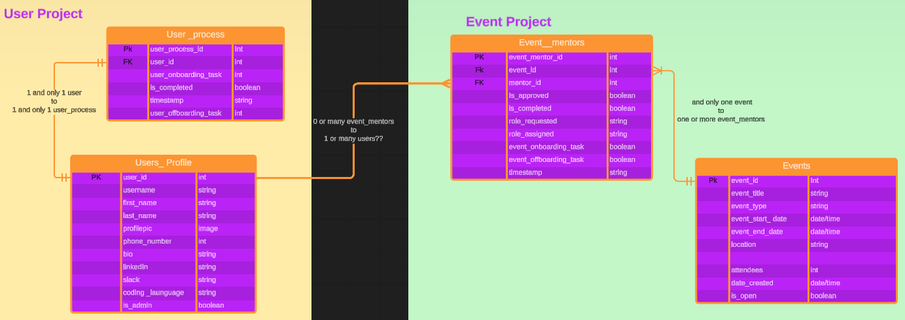

# Byte Time Backend

Backend repo for Byte Time, a final group project for the 2023/24 She Codes Plus program.

 ![Fly.io](https://img.shields.io/badge/Fly.io-black.svg?logo=data:image/svg%2bxml;base64,PHN2ZyB2aWV3Qm94PSIwIDAgMTY3IDE1MSIgeG1sbnM9Imh0dHA6Ly93d3cudzMub3JnLzIwMDAvc3ZnIiBmaWxsLXJ1bGU9ImV2ZW5vZGQiIGNsaXAtcnVsZT0iZXZlbm9kZCIgc3Ryb2tlLWxpbmVqb2luPSJyb3VuZCIgc3Ryb2tlLW1pdGVybGltaXQ9IjIiPjxwYXRoIGQ9Ik0xMTYuNzggMjAuNjEzaDE5LjIzYzE3LjEwNCAwIDMwLjk5IDEzLjg4NiAzMC45OSAzMC45OXY2Ny42MThjMCAxNy4xMDQtMTMuODg2IDMwLjk5LTMwLjk5IDMwLjk5aC0xLjUxNmMtOC44MDMtMS4zNzctMTIuNjIxLTQuMDE3LTE1LjU3LTYuMjQ4TDk0LjQ3NSAxMjMuODZhMy40NTMgMy40NTMgMCAwMC00LjMyOSAwbC03Ljk0MyA2LjUzMi0yMi4zNy0xOC4zOTRhMy40NDMgMy40NDMgMCAwMC00LjMyNiAwbC0zMS4wNzggMjcuMzM5Yy02LjI1NSA1LjA4Ny0xMC4zOTIgNC4xNDgtMTMuMDc1IDMuODUzQzQuNDI0IDEzNy41MDMgMCAxMjguODc0IDAgMTE5LjIyMVY1MS42MDNjMC0xNy4xMDQgMTMuODg2LTMwLjk5IDMwLjk5My0zMC45OUg1MC4xOGwtLjAzNS4wNzctLjY0NyAxLjg4Ni0uMjAxLjY0Ny0uODcxIDMuODYyLS4xMi42NzgtLjM4MiAzLjg2OC0uMDUxIDEuMDYyLS4wMDguMzcyLjAzNiAxLjc3NC4wODggMS4wMzkuMjE1IDEuNjI4LjI3NSAxLjQ2NC4zMjYgMS4zNDkuNDIzIDEuNDYgMS4wOTggMy4wOTIuMzYyLjkyNyAxLjkxMiA0LjA0LjY3NSAxLjI0MSAyLjIxMSAzLjc5NS44NDYgMS4zNjkgMy4wODYgNC41NDQuNDQ2LjYwMiA0LjAxNSA1LjIyNiAxLjI5NyAxLjYwOCA0LjU4NSA1LjM2Ljk0MiAxLjAzMSAzLjc3OSA0LjA2NiAxLjQ5NyAxLjU1IDIuNDc0IDIuNDU3LS40OTcuNDE1LS4zMDkuMjc5YTMwLjMwOSAzMC4zMDkgMCAwMC0yLjM4NCAyLjQ5Yy0uMzU5LjQyMy0uNzAxLjg2LTEuMDI1IDEuMzEtLjQ5NS42ODctLjkzOCAxLjQxLTEuMzI0IDIuMTY0LS4xOTguMzkxLS4zNzUuNzkyLS41MzEgMS4yMDJhMTEuMDk4IDExLjA5OCAwIDAwLS43MTggMy4yNjdsLS4wMTQuOTY2Yy4wMzUgMS4zNjIuMzEyIDIuNzA3LjgxOSAzLjk3MmExMS4wNiAxMS4wNiAwIDAwMi4yMDkgMy40NjQgMTEuMjc0IDExLjI3NCAwIDAwMi4zMjkgMS44OTZjLjczMS40NDcgMS41MS44MTYgMi4zMTkgMS4wOTYgMS43Ni41OTcgMy42MjcuODA5IDUuNDc2LjYyM2guMDFhMTIuMzQ3IDEyLjM0NyAwIDAwNC41MTYtMS4zNDEgMTEuNjQ3IDExLjY0NyAwIDAwMS43MjQtMS4xMTYgMTEuMDY3IDExLjA2NyAwIDAwMy40NzktNC42MjZjLjU2OS0xLjQyMi44NDgtMi45NDEuODIzLTQuNDcxbC0uMDQ0LS43OTlhMTEuMzA1IDExLjMwNSAwIDAwLS43NDktMy4wNzhjLS4xNy0uNDI5LS4zNjQtLjg0OC0uNTgtMS4yNTctLjQtLjc1Mi0uODU2LTEuNDczLTEuMzYyLTIuMTU4LS4yMzItLjMxMy0uNDcyLS42Mi0uNzItLjkyMWEyOS44MSAyOS44MSAwIDAwLTIuNjYxLTIuNzg3bC0uNjY5LS41NjkgMS4xMzMtMS4xMTkgNC44NjktNS4wODUgMS42ODQtMS44NDkgMi42MTgtMi45NDUgMS43MDMtMS45OTIgMi40MjgtMi45NTcgMS42NDQtMi4wNjcgMi40MTQtMy4yMjggMS4yMTktMS42NyAxLjcyOS0yLjU4NSAxLjQ0LTIuMjAzIDIuNzEzLTQuNzI1IDEuNTUyLTMuMS4wNDUtLjA5NSAxLjE4OC0yLjg3NmMuMDE1LS4wMzcuMDI5LS4wNzUuMDQtLjExNGwxLjI4LTMuOTkxLjEzNC0uNTgyLjU1NS0zLjE3Ny4xMDgtLjg2LjAzMy0uNTI3LjAzOC0xLjk4OS0uMDEtLjM3MS0uMTAyLTEuNzgxLS4xMjYtMS4zODMtLjYzLTMuOTg5YTEuNTIxIDEuNTIxIDAgMDAtLjAzNy0uMTU5bC0uODA5LTIuOTQ5LS4yNzktLjgyLS4zNjQtLjkwN3ptOS4xNDEgODQuMzIxYy00LjAwNy4wNTYtNy4yODcgMy4zMzYtNy4zNDMgNy4zNDIuMDU5IDQuMDA2IDMuMzM3IDcuMjg0IDcuMzQzIDcuMzQxIDQuMDA1LS4wNTggNy4yODQtMy4zMzUgNy4zNDUtNy4zNDEtLjA1OC00LjAwNi0zLjMzOC03LjI4Ni03LjM0NS03LjM0MnoiIGZpbGw9InVybCgjX1JhZGlhbDEpIi8+PHBhdGggZD0iTTcyLjQ5OSAxNDcuNTcxbC0xLjI5NiAxLjA5YTYuODAyIDYuODAyIDAgMDEtNC4yNTMgMS41NUgzMC45OTNhMzAuODY3IDMwLjg2NyAwIDAxLTE5LjYzOS03LjAyMWMyLjY4My4yOTUgNi44MiAxLjIzNCAxMy4wNzUtMy44NTNsMzEuMDc4LTI3LjMzOWEzLjQ0MyAzLjQ0MyAwIDAxNC4zMjYgMGwyMi4zNyAxOC4zOTQgNy45NDMtNi41MzJhMy40NTMgMy40NTMgMCAwMTQuMzI5IDBsMjQuNDQ5IDIwLjEwM2MyLjk0OSAyLjIzMSA2Ljc2NyA0Ljg3MSAxNS41NyA2LjI0OEgxMTguMjNhNi45MTkgNi45MTkgMCAwMS0zLjk5My0xLjMzbC0uMjg1LS4yMi0xLjIwNy0xLjAwM2EyLjM3NyAyLjM3NyAwIDAwLS4zMi0uMzIzIDIxODQ1LjI1NiAyMTg0NS4yNTYgMCAwMC0xOC42ODktMTUuNDk3IDIuMDM1IDIuMDM1IDAgMDAtMi42MDYuMDA2cy4wNDQuMDUyLTE4LjM4NiAxNS40OTFjLS4wOS4wNzUtLjE3Mi4xNTQtLjI0NS4yMzZ6bTUzLjQyMi00Mi42MzdjLTQuMDA3LjA1Ni03LjI4NyAzLjMzNi03LjM0MyA3LjM0Mi4wNTkgNC4wMDYgMy4zMzcgNy4yODQgNy4zNDMgNy4zNDEgNC4wMDUtLjA1OCA3LjI4NC0zLjMzNSA3LjM0NS03LjM0MS0uMDU4LTQuMDA2LTMuMzM4LTcuMjg2LTcuMzQ1LTcuMzQyek03OC40NTMgODIuNjg3bC0yLjQ3NC0yLjQ1Ny0xLjQ5Ny0xLjU1LTMuNzc5LTQuMDY2LS45NDItMS4wMzEtNC41ODUtNS4zNi0xLjI5Ny0xLjYwOS00LjAxNS01LjIyNS0uNDQ2LS42MDItMy4wODYtNC41NDQtLjg0Ni0xLjM2OS0yLjIxMS0zLjc5NS0uNjc1LTEuMjQxLTEuOTEyLTQuMDQtLjM2Mi0uOTI3LTEuMDk4LTMuMDkyLS40MjMtMS40Ni0uMzI2LTEuMzQ5LS4yNzUtMS40NjUtLjIxNS0xLjYyNy0uMDg4LTEuMDM5LS4wMzYtMS43NzQuMDA4LS4zNzIuMDUxLTEuMDYyLjM4Mi0zLjg2OS4xMi0uNjc3Ljg3MS0zLjg2Mi4yMDEtLjY0Ny42NDctMS44ODYuMjA3LS40ODggMS4wMy0yLjI2Mi43MTQtMS4zNDYuOTk0LTEuNjQuOTkxLTEuNDYuNzA2LS45MjguODEzLS45OC44OTUtLjk4NS43NjctLjc3MSAxLjg2Ny0xLjY0MyAxLjM2NS0xLjExN2MuMDMzLS4wMjguMDY3LS4wNTMuMTAyLS4wNzdsMS42MTUtMS4wOTIgMS4yODMtLjgxOEw2NS45MzEgMy44Yy4wMzctLjAyMy4wNzktLjA0MS4xMTgtLjA1OWwzLjQ1Ni0xLjQzNC4zMTktLjEyIDMuMDcyLS44OTkgMS4yOTctLjI5MSAxLjc1NC0uMzUyTDc3LjExLjQ2OGwxLjc4NC0uMjIyTDgwLjExLjEzOCA4Mi41MjUuMDFsLjk0Ni0uMDEgMS43OTEuMDM3LjQ2Ni4wMjYgMi41OTYuMjE2IDMuNDMzLjQ4NC4zOTcuMDgzIDMuMzkzLjg0NC45OTYuMjk3IDEuMTA3LjM4MyAxLjM0OC41MSAxLjA2Ni40NTIgMS41NjYuNzM4Ljk4Ny41MDcgMS43NzQgMS4wNDEuNjYxLjQwNyAyLjQxOCAxLjc2NS42OTQuNjAyIDEuNjg2IDEuNTM2LjA4My4wODMgMS40MyAxLjUzNC40OTIuNTU1IDEuNjc4IDIuMjMuMzQyLjUzMyAxLjMzMiAyLjI0OS40MDEuNzcxLjc1MSAxLjY3OC43ODUgMS45NTkuMjc5LjgyLjgwOSAyLjk0OWMuMDE1LjA1Mi4wMjcuMTA1LjAzNy4xNTlsLjYzIDMuOTg4LjEyNiAxLjM4NC4xMDIgMS43ODEuMDEuMzcxLS4wMzggMS45ODktLjAzMy41MjctLjEwOC44Ni0uNTU1IDMuMTc3LS4xMzQuNTgyLTEuMjggMy45OTFhMS4xODYgMS4xODYgMCAwMS0uMDQuMTE0bC0xLjE4OCAyLjg3Ni0uMDQ1LjA5NS0xLjU1MiAzLjEtMi43MTMgNC43MjUtMS40NCAyLjIwMy0xLjcyOSAyLjU4NS0xLjIxOSAxLjY3LTIuNDE0IDMuMjI4LTEuNjQ0IDIuMDY3LTIuNDI4IDIuOTU3LTEuNzAzIDEuOTkyLTIuNjE4IDIuOTQ1LTEuNjg0IDEuODQ5LTQuODY5IDUuMDg1LTEuMTMzIDEuMTE5LjY2OS41NjljLjk0Ni44NzEgMS44MzUgMS44IDIuNjYxIDIuNzg3LjI0OC4zMDEuNDg4LjYwOC43Mi45MjEuNTA2LjY4NS45NjIgMS40MDYgMS4zNjIgMi4xNTguMjE2LjQwNy40MDkuODI4LjU4IDEuMjU3LjM4OS45ODUuNjUxIDIuMDI2Ljc0OSAzLjA3OGwuMDQ0Ljc5OWMuMDI1IDEuNTMtLjI1NSAzLjA1LS44MjMgNC40NzFhMTEuMDU3IDExLjA1NyAwIDAxLTMuNDc5IDQuNjI1Yy0uNTQxLjQyNC0xLjExOC43OTYtMS43MjQgMS4xMTdhMTIuMzQ3IDEyLjM0NyAwIDAxLTQuNTE2IDEuMzQxaC0uMDFhMTIuOTk2IDEyLjk5NiAwIDAxLTUuNDc2LS42MjMgMTEuOTMzIDExLjkzMyAwIDAxLTIuMzE5LTEuMDk2IDExLjI2OCAxMS4yNjggMCAwMS0yLjMyOS0xLjg5NiAxMS4wNiAxMS4wNiAwIDAxLTIuMjA5LTMuNDY0IDExLjQ2OCAxMS40NjggMCAwMS0uODE5LTMuOTcybC4wMTQtLjk2NmMuMDczLTEuMTE5LjMxNS0yLjIyMS43MTgtMy4yNjcuMTU3LS40MTEuMzM0LS44MTIuNTMxLTEuMjAyLjM4Ni0uNzU1LjgzLTEuNDc3IDEuMzI0LTIuMTY0LjMyMy0uNDUuNjY3LS44ODcgMS4wMjUtMS4zMWEzMC4zMDkgMzAuMzA5IDAgMDEyLjM4NC0yLjQ5bC4zMDktLjI3OS40OTctLjQxNXoiIGZpbGw9IiMyNDE3NWIiLz48cGF0aCBkPSJNNzEuMjAzIDE0OC42NjFsMTkuOTI3LTE2LjgxN2EyLjAzNSAyLjAzNSAwIDAxMi42MDYtLjAwNmwyMC4yMTYgMTYuODIzYTYuOTA2IDYuOTA2IDAgMDA0LjM1MSAxLjU1SDY2Ljg3N2E2LjgwNSA2LjgwNSAwIDAwNC4zMjYtMS41NXptMTIuNDA0LTYwLjAzNGwuMTk1LjA1N2MuMDYzLjAzLjExNi4wNzUuMTczLjExNGwuMTYzLjE0NGMuNDAyLjM3Ljc5My43NTkgMS4xNjkgMS4xNTcuMjY1LjI4My41MjMuNTc0Ljc3MS44NzUuMzE1LjM4LjYxLjc3OS44NzkgMS4xOTQuMTE2LjE4My4yMjQuMzY4LjMyNS41NjEuMDg4LjE2Ny4xNjcuMzQuMjM2LjUxNS4xMjIuMzA1LjIxNC42MjcuMjQyLjk1NGwtLjAwNi42MTRhMy41MDcgMy41MDcgMCAwMS0xLjY2MiAyLjczMiA0Ljc0NyA0Ljc0NyAwIDAxLTIuMDIxLjY2NWwtLjc1OS4wMjItLjY0MS0uMDU2YTQuOTY0IDQuOTY0IDAgMDEtLjg4MS0uMjE0IDQuMTcgNC4xNyAwIDAxLS44MzQtLjM5MWwtLjUtLjM2NmEzLjQzMSAzLjQzMSAwIDAxLTEuMTM5LTEuOTUyIDUuMDE2IDUuMDE2IDAgMDEtLjA1OS0uMzg3bC0uMDE4LS41ODZjLjAxLS4xNTguMDM0LS4zMTUuMDY5LS40NzIuMDg3LS4zNDEuMjEzLS42NzMuMzcyLS45ODguMjA1LS4zOTYuNDM5LS43NzYuNy0xLjEzNy40MzMtLjU4Ni45MDMtMS4xNDMgMS40MDUtMS42Ny4zMjQtLjM0Mi42NTUtLjY3MyAxLjAwMS0uOTkzbC4yNDYtLjIyMWMuMTcxLS4xMTQuMTczLS4xMTQuMzY4LS4xNzFoLjIwNnpNODIuMzQ4IDYuOTU2bC4wNzktLjAwNnY2OC40ODRsLS4xNzEtLjMxNWExOTEuMjY0IDE5MS4yNjQgMCAwMS02LjI5MS0xMi43NSAxMzYuMzE4IDEzNi4zMTggMCAwMS00LjI2OS0xMC42ODggODQuMzU4IDg0LjM1OCAwIDAxLTIuNTc0LTguODAyYy0uNTQxLTIuMzY1LS45NTYtNC43NjUtMS4xMjYtNy4xOWEzNS4wMjggMzUuMDI4IDAgMDEtLjA1OS0zLjEwOGMuMDE2LS45MDMuMDUzLTEuODA0LjEwOS0yLjcwNS4wOS0xLjQxOC4yMzQtMi44MzIuNDQyLTQuMjM1LjE2NS0xLjEwNC4zNjgtMi4yMDUuNjItMy4yOTMuMi0uODY1LjQzMS0xLjcyMy42OTYtMi41NjcuMzgyLTEuMjIuODQtMi40MTIgMS4zNzMtMy41NzYuMTk1LS40MTkuNDA1LS44MzYuNjI0LTEuMjQ1IDEuMzIyLTIuNDQ5IDMuMTE2LTQuNzA0IDUuNDY2LTYuMjE0YTExLjQyMiAxMS40MjIgMCAwMTUuMDgxLTEuNzl6bTguODguMTczbDQuNjA3IDEuMzE0YTI4LjE5MyAyOC4xOTMgMCAwMTYuMDc2IDMuMDk2IDI0LjM4NyAyNC4zODcgMCAwMTYuNTMzIDYuNTE3IDI0LjYxOCAyNC42MTggMCAwMTIuNTMxIDQuODc4IDI4LjU4NiAyOC41ODYgMCAwMTEuNzYxIDcuODk4Yy4wNjEuNzA4LjA5NiAxLjQxOC4xMSAyLjEyNy4wMTYuNjU5LjAxMiAxLjMyMS0uMDQxIDEuOThhMjIuMzA2IDIyLjMwNiAwIDAxLS44MjggNC4zNTIgMzQuMjgxIDM0LjI4MSAwIDAxLTEuMTk0IDMuNDI2IDQ5LjQzIDQ5LjQzIDAgMDEtMS44OTUgNC4wOTRjLTEuNTM2IDIuOTY2LTMuMzA0IDUuODAzLTUuMTk1IDguNTQ3YTEzMy4xMTggMTMzLjExOCAwIDAxLTcuNDkxIDkuNzc2IDE4NS40NjYgMTg1LjQ2NiAwIDAxLTguOTg3IDkuOTZjMi4xMTQtMy45NjMgNC4wODctOCA1LjkxNS0xMi4xMDJhMTQ5Ljk2IDE0OS45NiAwIDAwMi44NzYtNi45MyAxMDguNzk5IDEwOC43OTkgMCAwMDIuNjc5LTcuNzkyIDc2LjMyNyA3Ni4zMjcgMCAwMDEuNTQtNS45NzZjLjM2OC0xLjcyNy42NTctMy40NzIuODM2LTUuMjI4LjE1LTEuNDY0LjIwNS0yLjkzNy4xNjktNC40MDZhNjIuMTU0IDYyLjE1NCAwIDAwLS4xLTIuNjk1Yy0uMjE2LTMuNjEyLS43NjUtNy4yMTItMS44MTgtMTAuNjc2YTMxLjI1NSAzMS4yNTUgMCAwMC0xLjQ1My0zLjg0OWMtMS4zNDgtMi45MzctMy4yMy01LjY4My01Ljc3Ni03LjY4NmwtLjg1NS0uNjI1eiIgZmlsbD0iI2ZmZiIvPjxkZWZzPjxyYWRpYWxHcmFkaWVudCBpZD0iX1JhZGlhbDEiIGN4PSIwIiBjeT0iMCIgcj0iMSIgZ3JhZGllbnRVbml0cz0idXNlclNwYWNlT25Vc2UiIGdyYWRpZW50VHJhbnNmb3JtPSJ0cmFuc2xhdGUoODguNjcgODQuODQ4KSBzY2FsZSgxMjAuOTc3KSI+PHN0b3Agb2Zmc2V0PSIwIiBzdG9wLWNvbG9yPSIjYmE3YmYwIi8+PHN0b3Agb2Zmc2V0PSIuNDUiIHN0b3AtY29sb3I9IiM5OTZiZWMiLz48c3RvcCBvZmZzZXQ9IjEiIHN0b3AtY29sb3I9IiM1MDQ2ZTQiLz48L3JhZGlhbEdyYWRpZW50PjwvZGVmcz48L3N2Zz4=&style=for-the-badge&labelColor=white)   ![Draw.io](https://img.shields.io/badge/Draw.io-black.svg?logo=data:image/svg%2bxml;base64,PHN2ZyBlbmFibGUtYmFja2dyb3VuZD0ibmV3IDAgMCAxODU4IDI0OTkuNiIgdmlld0JveD0iMCAwIDE4NTggMjQ5OS42IiB4bWxucz0iaHR0cDovL3d3dy53My5vcmcvMjAwMC9zdmciPjxwYXRoIGQ9Im0xODU4IDE3NzguN2MwIDQ0LjgtMzYuOCA3OS4zLTc5LjMgNzkuM2gtMTY5OS40Yy00NC44IDAtNzkuMy0zNi44LTc5LjMtNzkuM3YtMTY5OS40YzAtNDQuOCAzNi44LTc5LjMgNzkuMy03OS4zaDE2OTkuM2M0NC44IDAgNzkuMyAzNi44IDc5LjMgNzkuM3YxNjk5LjR6IiBmaWxsPSIjZjA4NzA1Ii8+PHBhdGggZD0ibTE4NTggMTc3OC43YzAgNDQuOC0zNi44IDc5LjMtNzkuMyA3OS4zaC0xMTQyLjlsLTM3MC4yLTM3NiAyMzAtMzc2IDY4My04NDguNSA2NzcuMiA2OTcuOXoiIGZpbGw9IiNkZjZjMGMiLz48cGF0aCBkPSJtMTUyNS43IDEwMzguMmgtMTk1LjVsLTIwNy0zNTEuOGM0Ni05LjIgODAuNS01MC42IDgwLjUtOTguOXYtMjY1LjZjMC01Ni4zLTQ0LjgtMTAxLjItMTAxLjItMTAxLjJoLTM0NC44Yy01Ni4zIDAtMTAxLjIgNDQuOC0xMDEuMiAxMDEuMnYyNjUuNmMwIDQ5LjQgMzQuNSA4OS43IDc5LjMgOTguOWwtMjA3IDM1M2gtMTk1LjRjLTU2LjMgMC0xMDEuMiA0NC44LTEwMS4yIDEwMS4ydjI2NS42YzAgNTYuMyA0NC44IDEwMS4yIDEwMS4yIDEwMS4yaDM0NC45YzU2LjMgMCAxMDEuMi00NC44IDEwMS4yLTEwMS4ydi0yNjUuNmMwLTU2LjMtNDQuOC0xMDEuMi0xMDEuMi0xMDEuMmgtMzMuM2wyMDQuNy0zNDkuNWgxNTkuOGwyMDUuOCAzNDkuNWgtMzQuNWMtNTYuMyAwLTEwMS4yIDQ0LjgtMTAxLjIgMTAxLjJ2MjY1LjZjMCA1Ni4zIDQ0LjggMTAxLjIgMTAxLjIgMTAxLjJoMzQ0LjljNTYuMyAwIDEwMS4yLTQ0LjggMTAxLjItMTAxLjJ2LTI2NS42YzAtNTYuNC00NC44LTEwMi40LTEwMS4yLTEwMi40eiIgZmlsbD0iI2ZmZiIvPjxwYXRoIGQ9Im0yNjMuMyAyNDgzLjVjMCAyLjMgMCAzLjQtMS4xIDUuNy0xLjEgMS4xLTIuMyAyLjMtNC42IDMuNHMtNS43IDEuMS05LjIgMi4zYy0zLjQgMC05LjIgMS4xLTE0LjkgMS4xcy0xMS41IDAtMTQuOS0xLjFjLTMuNCAwLTYuOS0xLjEtOS4yLTIuMy0yLjMtMS4xLTQuNi0yLjMtNS43LTMuNHMtMS4xLTMuNC0xLjEtNS43di0yOC43Yy0xMy44IDE0LjktMjcuNiAyNS4zLTQyLjUgMzMuM3MtMzEgMTEuNS00OS40IDExLjVjLTE5LjUgMC0zNi44LTMuNC01MC42LTExLjUtMTMuOC04LTI1LjMtMTguNC0zMy4zLTMxLTkuMi0xMi42LTE0LjktMjguNy0xOC40LTQ2LTMuNC0xNy4yLTUuNy0zNS42LTUuNy01NS4yIDAtMjMgMi4zLTQzLjcgNi45LTYzLjIgNC42LTE4LjQgMTIuNi0zNC41IDIxLjgtNDcuMXMyMS44LTIzIDM1LjYtMjkuOSAzMS0xMC4zIDQ5LjQtMTAuM2MxNC45IDAgMjcuNiAzLjQgNDAuMiA5LjIgMTEuNSA1LjcgMjQuMSAxNC45IDM1LjYgMjYuNHYtMTQxLjRjMC0yLjMgMC0zLjQgMS4xLTUuNyAxLjEtMS4xIDMuNC0zLjQgNS43LTMuNCAyLjMtMS4xIDYuOS0yLjMgMTEuNS0yLjMgNC42LTEuMSAxMC4zLTEuMSAxOC40LTEuMSA2LjkgMCAxMi42IDAgMTguNCAxLjEgNC42IDEuMSA4IDEuMSAxMS41IDIuMyAyLjMgMS4xIDQuNiAyLjMgNS43IDMuNHMyLjMgMy40IDIuMyA1Ljd6bS03My42LTE3NC44Yy0xMC4zLTEzLjgtMjAuNy0yMy0yOS45LTMxLTkuMi02LjktMTkuNS0xMC4zLTI5LjktMTAuMy05LjIgMC0xOC40IDIuMy0yNS4zIDYuOXMtMTIuNiAxMS41LTE3LjIgMTkuNS02LjkgMTcuMi05LjIgMjYuNGMtMi4zIDEwLjMtMy40IDE5LjUtMy40IDI5LjkgMCAxMS41IDEuMSAyMS44IDIuMyAzMi4yIDIuMyAxMC4zIDQuNiAxOS41IDkuMiAyNy42IDMuNCA4IDkuMiAxNC45IDE2LjEgMTkuNXMxNC45IDYuOSAyNS4zIDYuOWM0LjYgMCAxMC4zLTEuMSAxNC45LTIuM3M5LjItMy40IDE0LjktNi45YzQuNi0zLjQgMTAuMy04IDE0LjktMTIuNiA1LjctNS43IDExLjUtMTEuNSAxNy4yLTE5LjV2LTg2LjN6bTMxMi43LTYyLjFjMCA2LjkgMCAxMi42LTEuMSAxNy4yIDAgNC42LTEuMSA4LTIuMyAxMC4zLTEuMSAyLjMtMi4zIDQuNi0zLjQgNS43cy0zLjQgMS4xLTQuNiAxLjEtMy40IDAtNS43LTEuMS00LjYtMS4xLTYuOS0yLjMtNC42LTEuMS04LTIuM2MtMy40LTEuMS01LjctMS4xLTkuMi0xLjEtNC42IDAtOCAxLjEtMTIuNiAyLjMtNC42IDEuMS04IDQuNi0xMi42IDhzLTkuMiA4LTEzLjggMTMuOGMtNC42IDUuNy0xMC4zIDEyLjYtMTQuOSAyMS44djE2My4zYzAgMi4zLTEuMSAzLjQtMi4zIDQuNnMtMy40IDIuMy01LjcgMy40LTYuOSAxLjEtMTEuNSAyLjNjLTQuNiAwLTEwLjMgMS4xLTE4LjQgMS4xLTYuOSAwLTEyLjYgMC0xOC40LTEuMS00LjYgMC04LTEuMS0xMS41LTIuMy0yLjMtMS4xLTQuNi0yLjMtNS43LTMuNHMtMi4zLTMuNC0yLjMtNC42di0yNjFjMC0yLjMgMC0zLjQgMS4xLTQuNiAxLjEtMS4xIDIuMy0yLjMgNS43LTMuNCAyLjMtMS4xIDUuNy0xLjEgMTAuMy0yLjMgMy40IDAgOS4yLTEuMSAxNC45LTEuMXMxMS41IDAgMTYuMSAxLjFjNC42IDAgNi45IDEuMSA5LjIgMi4zIDIuMyAxLjEgMy40IDIuMyA0LjYgMy40IDEuMSAxLjEgMS4xIDMuNCAxLjEgNC42djMyLjJjNi45LTkuMiAxMy44LTE3LjIgMTkuNS0yNC4xczExLjUtMTEuNSAxNy4yLTE0LjkgMTEuNS01LjcgMTYuMS04YzUuNy0xLjEgMTEuNS0yLjMgMTYuMS0yLjNoOGMzLjQgMCA1LjcgMS4xIDkuMiAxLjEgMy40IDEuMSA1LjcgMS4xIDggMi4zbDQuNiAyLjNjMS4xIDEuMSAyLjMgMi4zIDIuMyAzLjRzMS4xIDIuMyAxLjEgNC42IDEuMSA0LjYgMS4xIDkuMmM0LjcgNS45IDQuNyAxMC41IDQuNyAxOC41em0yNjYuOCAyMzhjMCAyLjMtMS4xIDQuNi0zLjQgNi45LTIuMyAxLjEtNC42IDIuMy05LjIgMy40cy0xMC4zIDEuMS0xOC40IDEuMWMtOS4yIDAtMTQuOSAwLTE5LjUtMS4xLTMuNC0xLjEtNi45LTIuMy04LTMuNHMtMi4zLTMuNC0yLjMtNi45di0yMC43Yy0xMC4zIDExLjUtMjMgMjAuNy0zNi44IDI2LjQtMTMuOCA2LjktMjguNyA5LjItNDYgOS4yLTEzLjggMC0yNi40LTIuMy0zNy45LTUuN3MtMjEuOC05LjItMjkuOS0xNi4xYy04LTYuOS0xNC45LTE2LjEtMTkuNS0yNi40cy02LjktMjMtNi45LTM2LjhjMC0xNC45IDMuNC0yOC43IDkuMi00MC4yczE0LjktMjAuNyAyNi40LTI3LjYgMjYuNC0xMi42IDQzLjctMTYuMWMxNy4yLTMuNCAzNy45LTUuNyA2MC45LTUuN2gyNS4zdi0xNi4xYzAtOC0xLjEtMTQuOS0yLjMtMjEuOC0xLjEtNS43LTQuNi0xMS41LTgtMTQuOS0zLjQtNC42LTkuMi02LjktMTQuOS05LjItNi45LTIuMy0xMy44LTMuNC0yNC4xLTMuNC0xMi42IDAtMjMgMS4xLTMzLjMgNC42LTkuMiAyLjMtMTguNCA1LjctMjUuMyA5LjJsLTE4LjQgOS4yYy00LjYgMi4zLTkuMiA0LjYtMTIuNiA0LjYtMi4zIDAtNC42LTEuMS01LjctMi4zLTEuMS0xLjEtMy40LTMuNC00LjYtNS43LTEuMS0yLjMtMi4zLTUuNy0yLjMtOS4yLTEuMS0zLjQtMS4xLTgtMS4xLTEyLjYgMC01LjcgMC0xMC4zIDEuMS0xMy44IDEuMS0zLjQgMi4zLTYuOSA1LjctOS4yIDIuMy0yLjMgOC01LjcgMTMuOC05LjIgNi45LTMuNCAxNC45LTYuOSAyNC4xLTkuMiA5LjItMy40IDE5LjUtNS43IDI5LjktNi45IDEwLjMtMi4zIDIxLjgtMi4zIDMzLjMtMi4zIDIwLjcgMCAzNy45IDIuMyA1Mi45IDUuNyAxNC45IDMuNCAyNi40IDEwLjMgMzUuNiAxOC40IDkuMiA4IDE2LjEgMTkuNSAyMC43IDMyLjIgNC42IDEyLjYgNi45IDI4LjcgNi45IDQ3LjF6bS03Mi41LTExMi43aC0yNy42Yy0xMS41IDAtMjEuOCAxLjEtMzEgMi4zLTggMi4zLTE0LjkgNC42LTIwLjcgOC01LjcgMy40LTkuMiA4LTExLjUgMTIuNnMtMy40IDEwLjMtMy40IDE3LjJjMCAxMS41IDMuNCAxOS41IDEwLjMgMjUuMyA2LjkgNS43IDE2LjEgOS4yIDI4LjcgOS4yIDEwLjMgMCAxOS41LTIuMyAyOC43LThzMTcuMi0xMi42IDI2LjQtMjN2LTQzLjZ6bTUzNy0xNTAuNmMwIDIuMyAwIDQuNi0xLjEgOHMtMS4xIDgtMy40IDEzLjhsLTcwLjIgMjM2LjljLTEuMSAzLjQtMi4zIDUuNy0zLjQgOHMtMy40IDMuNC02LjkgNC42Yy0zLjQgMS4xLTggMi4zLTEzLjggMi4zLTUuNyAwLTEzLjggMS4xLTIzIDEuMXMtMTcuMiAwLTIzLTEuMWMtNS43IDAtMTAuMy0xLjEtMTMuOC0yLjMtMy40LTEuMS01LjctMi4zLTgtNC42LTEuMS0yLjMtMi4zLTQuNi0zLjQtOGwtNDMuNy0xNTguNy0xLjEtMi4zLTEuMSAyLjMtNDAuNSAxNTguN2MtMS4xIDMuNC0yLjMgNS43LTMuNCA4cy0zLjQgMy40LTggNC42Yy0zLjQgMS4xLTggMi4zLTEzLjggMi4zLTUuNyAwLTEzLjggMS4xLTIzIDEuMS0xMC4zIDAtMTcuMiAwLTI0LjEtMS4xLTUuNyAwLTEwLjMtMS4xLTEzLjgtMi4zLTMuNC0xLjEtNS43LTIuMy04LTQuNi0xLjEtMi4zLTIuMy00LjYtMy40LThsLTY5LTIzNi44Yy0yLjMtNS43LTMuNC0xMC4zLTMuNC0xMy44IDAtMy40LTEuMS01LjctMS4xLThzMC0zLjQgMS4xLTQuNmMxLjEtMS4xIDMuNC0yLjMgNS43LTMuNHM2LjktMS4xIDExLjUtMi4zYzQuNiAwIDEwLjMtMS4xIDE4LjQtMS4xczEzLjggMCAxOS41IDEuMWM0LjYgMCA5LjIgMS4xIDExLjUgMi4zIDIuMyAxLjEgNC42IDIuMyA1LjcgMy40czIuMyAzLjQgMi4zIDUuN2w1MS43IDE5MiAxLjEgMy40IDEuMS0zLjQgNDguMy0xOTJjMS4xLTIuMyAxLjEtNC42IDIuMy01LjcgMS4xLTEuMSAzLjQtMy40IDUuNy0zLjQgMi4zLTEuMSA1LjctMS4xIDEwLjMtMi4zIDQuNiAwIDEwLjMtMS4xIDE3LjItMS4xczEyLjYgMCAxNy4yIDEuMWM0LjYgMCA4IDEuMSAxMC4zIDIuM3M0LjYgMi4zIDUuNyAzLjQgMi4zIDMuNCAyLjMgNC42bDUxLjcgMTkzLjIgMS4xIDMuNCAxLjEtMy40IDQ5LjQtMTkyYzAtMi4zIDEuMS00LjYgMi4zLTUuNyAxLjEtMS4xIDMuNC0zLjQgNS43LTMuNCAyLjMtMS4xIDYuOS0xLjEgMTEuNS0yLjMgNC42IDAgMTAuMy0xLjEgMTguNC0xLjEgNi45IDAgMTIuNiAwIDE3LjIgMS4xIDQuNiAwIDggMS4xIDEwLjMgMi4zIDIuMyAxLjEgNC42IDIuMyA1LjcgMy40IDQuMSAxIDQuMSAyLjEgNC4xIDQuNHptMTA5LjIgMjMwYzAgMTguNC0zLjQgMjkuOS05LjIgMzYuOC02LjkgNS43LTE3LjIgOS4yLTM0LjUgOS4yLTE2LjEgMC0yNy42LTMuNC0zNC41LTkuMi01LjctNS43LTkuMi0xOC40LTkuMi0zNC41IDAtMTguNCAzLjQtMzEgOS4yLTM2LjggNi45LTUuNyAxOC40LTkuMiAzNC41LTkuMnMyNy42IDMuNCAzMy4zIDkuMmM4LjEgNC42IDEwLjQgMTcuMiAxMC40IDM0LjV6IiBmaWxsPSIjMzMzIi8+PHBhdGggZD0ibTE0OTguMSAyMTMyLjhjMCAxNC45LTMuNCAyNS4zLTkuMiAzMS01LjcgNS43LTE3LjIgOC0zMy4zIDhzLTI3LjYtMi4zLTMzLjMtOC05LjItMTQuOS05LjItMjkuOSAzLjQtMjUuMyA5LjItMzEgMTcuMi05LjIgMzMuMy05LjIgMjcuNiAyLjMgMzMuMyA4YzYuOSA2LjkgOS4yIDE3LjMgOS4yIDMxLjF6bS00LjYgMzUwLjdjMCAyLjMtMS4xIDMuNC0yLjMgNC42LTEuMSAxLjEtMy40IDIuMy01LjcgMy40cy02LjkgMS4xLTExLjUgMi4zYy00LjYgMC0xMC4zIDEuMS0xOC40IDEuMS02LjkgMC0xMi42IDAtMTguNC0xLjEtNC42IDAtOC0xLjEtMTEuNS0yLjMtMi4zLTEuMS00LjYtMi4zLTUuNy0zLjRzLTIuMy0zLjQtMi4zLTQuNnYtMjYxYzAtMi4zIDEuMS0zLjQgMi4zLTQuNiAxLjEtMS4xIDMuNC0yLjMgNS43LTMuNHM2LjktMi4zIDExLjUtMi4zYzQuNi0xLjEgMTAuMy0xLjEgMTguNC0xLjFzMTIuNiAwIDE4LjQgMS4xYzQuNiAxLjEgOCAxLjEgMTEuNSAyLjMgMi4zIDEuMSA0LjYgMi4zIDUuNyAzLjRzMi4zIDMuNCAyLjMgNC42em0zNDEuNS0xMzMuNGMwIDIxLjgtMy40IDQyLjUtOS4yIDYwLjktNS43IDE4LjQtMTQuOSAzNC41LTI2LjQgNDcuMS0xMS41IDEzLjgtMjYuNCAyMy00NC44IDMxLTE4LjQgNi45LTM5LjEgMTAuMy02My4yIDEwLjMtMjMgMC00My43LTMuNC02MC45LTkuMi0xNy4yLTYuOS0zMS0xNi4xLTQyLjUtMjcuNi0xMS41LTEyLjYtMTkuNS0yNy42LTI1LjMtNDYtNS43LTE4LjQtOC0zNy45LTgtNjIuMSAwLTIxLjggMy40LTQyLjUgOS4yLTYwLjkgNS43LTE4LjQgMTQuOS0zNC41IDI2LjQtNDcuMXMyNi40LTIzIDQ0LjgtMzFjMTguNC02LjkgMzkuMS0xMC4zIDYzLjItMTAuMyAyMyAwIDQzLjcgMy40IDYwLjkgOS4yIDE3LjIgNi45IDMxIDE2LjEgNDIuNSAyNy42IDExLjUgMTIuNiAxOS41IDI3LjYgMjUuMyA0NiA0LjYgMTguNCA4IDM5LjEgOCA2Mi4xem0tNzUuOSAyLjNjMC0xMi42LTEuMS0yNS4zLTMuNC0zNS42cy01LjctMjAuNy0xMC4zLTI4LjctMTEuNS0xMy44LTE5LjUtMTguNC0xOC40LTYuOS0zMS02LjljLTExLjUgMC0yMC43IDIuMy0yOC43IDUuN3MtMTQuOSAxMC4zLTIwLjcgMTcuMmMtNS43IDgtOS4yIDE3LjItMTEuNSAyNy42LTIuMyAxMC4zLTMuNCAyMy0zLjQgMzYuOCAwIDEyLjYgMS4xIDI1LjMgMy40IDM1LjZzNS43IDIwLjcgMTAuMyAyOC43IDExLjUgMTMuOCAxOS41IDE4LjQgMTguNCA2LjkgMzEgNi45YzExLjUgMCAyMC43LTIuMyAyOC43LTUuN3MxNC45LTEwLjMgMjAuNy0xNy4yYzUuNy04IDkuMi0xNy4yIDExLjUtMjcuNnMzLjQtMjMgMy40LTM2Ljh6IiBmaWxsPSIjZjA4NzA1Ii8+PC9zdmc+&style=for-the-badge&labelColor=orange)    

[](https://opensource.org/licenses/MIT)

---

[About](#about) ✦ [Database Schema](#database-schema) ✦ [Future Developments](#future-developments) ✦ [Resources](#resources) ✦ [License](#license) ✦ [Contact](#contact)

---

## About

https://bytetime.netlify.app/

### What is Byte Time?

Byte Time is an app that facilitates the onboarding and management process of assigning users to an event based on availability and skill set.

### Why Byte Time?

Created as part of the 2023/24 She Codes Plus Cohort. The team consisted of: Charlotte Durber, Cathy O'Halloran, Shannon Oliver, Jignasa Patel, Bex Logan and Caoimhe Young.

For this project, we were asked to create an internal platform to schedule mentors for the She Codes Company.

This repo is for the backend of the app. If you are interested in the frontend, please visit https://github.com/SheCodesAus/2024_bit_by_bit_frontend

### Intended Audience/User Stories

```md
AS AN Admin
I WANT to onboard a mentor
SO THAT I can match the mentor with an event.
```

```md
AS A Mentor
I WANT to create a mentor profile
SO THAT I can be mentor at She Codes events
```

```md
AS AN admin
I WANT to organise an event with appropriate staffing
SO THAT events can run smoothly.
```

## Database Schema



## Future Developments

## Resources

## License

This project is using the following license:

**MIT**

For further information regarding the license, please follow the link below:
https://opensource.org/licenses/MIT

---

## Contact

If you have any further questions, please contact via email or github.

| Name             | Role                               | Email                                                                                                                                                                  | Github                                                                                                                                                                                                | LinkedIn                                                                                                                                                                             |
| ---------------- | ---------------------------------- | ---------------------------------------------------------------------------------------------------------------------------------------------------------------------- | ----------------------------------------------------------------------------------------------------------------------------------------------------------------------------------------------------- | ------------------------------------------------------------------------------------------------------------------------------------------------------------------------------------ |
| Charlotte Durber | Project Manager                    | <a href="cdurber@gmail.com">            | <a href="https://github.com/cdurber90"></a>     | <a href="https://www.linkedin.com/in/charlottedurber/">            |
| Cathy O'Halloran | Backend Lead                       | <a href="cathy.o'halloran@rwwa.com.au"> | <a href="https://github.com/COHally/"></a>      | <a href="https://www.linkedin.com/in/cathy-o-halloran-60687b288/"> |
| Shannon Oliver   | Frontend Designer                  | <a href="shannon-alexis@hotmail.com">   | <a href="https://github.com/shannon97"></a>     | <a href="https://www.linkedin.com/in/shannon-a-oliver/">           |
| Jignasa Patel    | Database Designer                  | <a href="jigudhari_23@yahoo.com">       | <a href="https://github.com/Jigudhari"></a>     | <a href="https://www.linkedin.com/in/jignasa23/">                  |
| Bex Logan        | Git Manager                        | <a href="bek.jayne@gmail.com">          | <a href="https://github.com/BBLogan"></a>       | <a href="https://www.linkedin.com/in/bexlogan/">                   |
| Caoimhe Young    | Front End engineer and Git Manager | <a href="caoimhejyoti@gmail.com">       | <a href="https://github.com/caoimhejyoti/"></a> | <a href="https://www.linkedin.com/in/caoimhe-young/">              |
